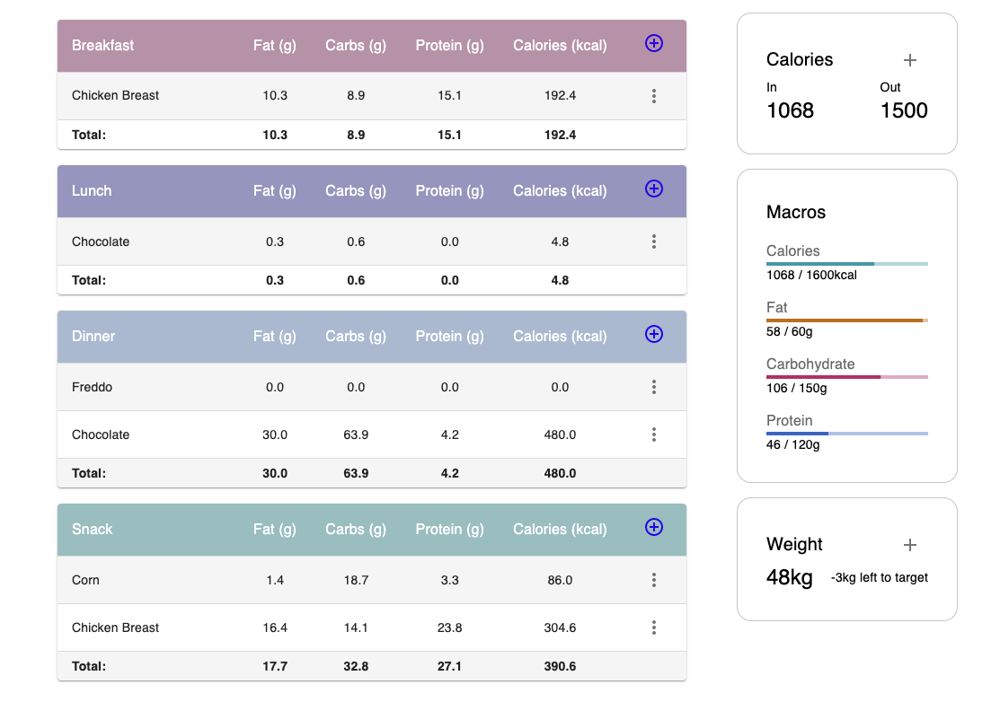
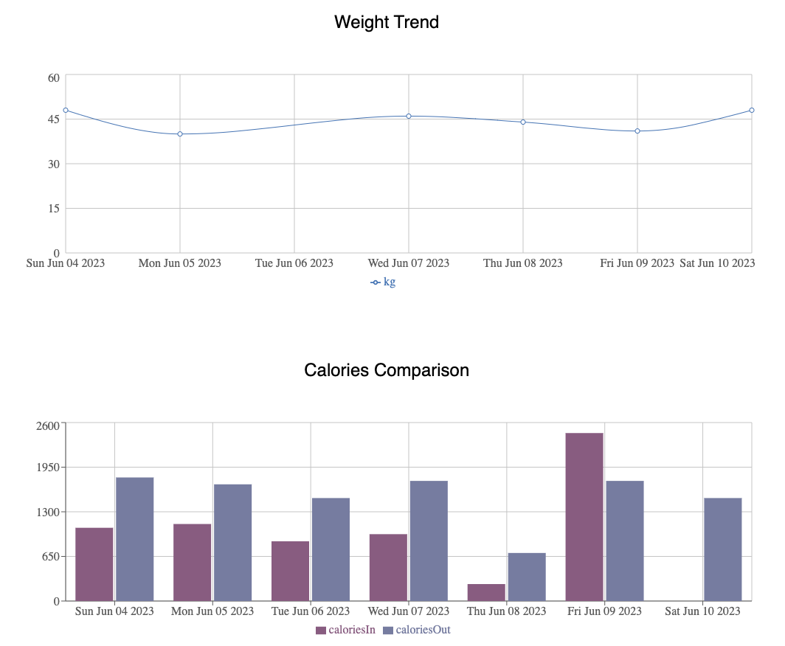
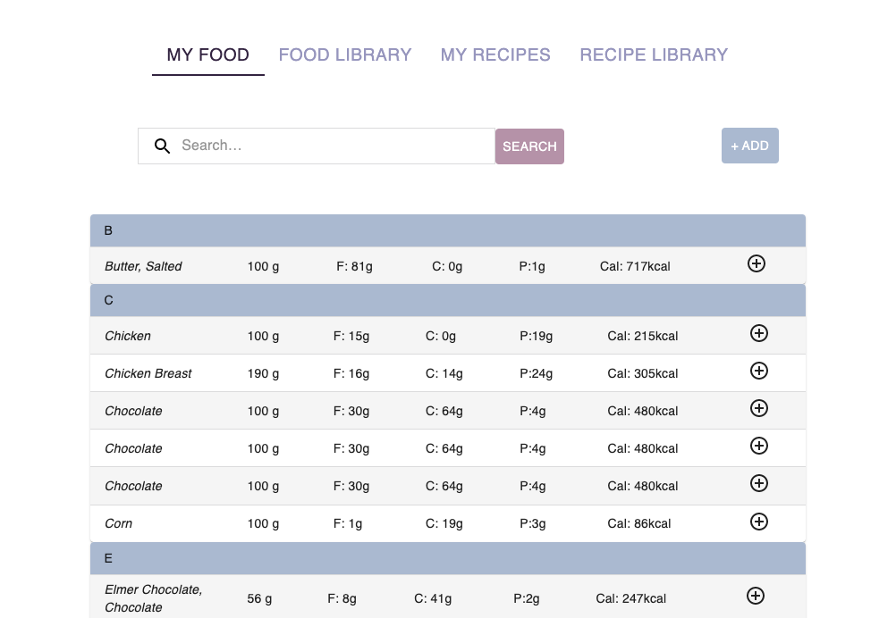
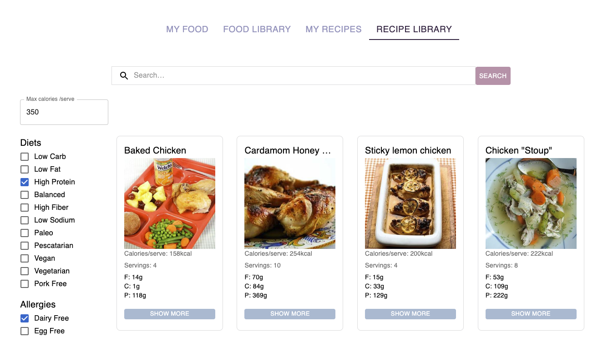

# Macro Health Tracking

## Table of Contents
- [Project Description](#project-description)
- [Technologies](#technologies)
- [Challenges](#challenges)
- [Future Features](#future-features)
- [Installation and Running](#installation-and-running)
- [Using the App](#using-the-app)
- [Original Wireframes](#original-wireframes)
- [Credits](#credits)
- [User Stories](./UserStories.md)
- [Wire Frames](./Wireframes.md)
- [License](#./License.md)

## Project Description
This is a health diary that allows users to track their health and fitness journey. Whether your goal is to lose weight or simply lead a healthier lifestyle by keeping track of your food intake, using a macro tracking app like this is the way to go.

By using this app, you will be able to log your food intake, including data such as:
- Calories
- Fats
- Proteins
- Carbohydrates

You will have the option to create your own custom foods, but you will also have access to our extensive library of foods. Additionally, to make things easier, you can search and filter for recipes to suit your personal needs through our recipe collection. Our recipe search allows you to filter based on allergies or dietary/health requirements, as well as by calories per serving, which is especially helpful if you are watching your calorie intake.

To simplify the process, you can set your food intake goals, specifying the number of grams for each macro, your calorie limit, and your weight goal. Visual data is provided through charts to show your progress, including:
- Display of calories consumed and burned
- Progression of macros and calorie intake throughout the day
- Display of your current weight and its proximity to your weight goal
- Line graph showing the trend of your weight over the past week
- Bar chart comparing your daily calories consumed versus burned over the past week

If you prefer planning ahead, you can easily log data for future dates using the calendar picker.






## Technologies
This web application utilizes React.js, which allows for a highly interactive front-end and enables the creation of the best single-page application while allowing the features of multipage applications (SPAs and MPAs). The backend is powered by Supabase, which provides additional security features such as OTP, enhanced user authentication, sign-in through third-party apps, and easy database organization. The front-end has been styled with Material UI, a comprehensive UI framework that offers a wide range of components and features. The designs have been specifically crafted to be user-friendly and visually appealing.

## Challenges
Due to the extensive amount of data and data manipulation involved in this app, organizing all the data for this project was time-consuming. Some calculations were also more complex, particularly when it came to creating custom objects through different API calls to render data for the statistical charts. Due to React's component rendering methods, there are a couple of minor bugs that require an extra refresh after loading to view all the data. These issues will be resolved in future updates.

Using pre-styled components with Material UI posed challenges in terms of design customization. Overriding basic elements such as hover states, colors, and sizes proved to be quite difficult. However, having pre-styled components also proved useful in other aspects (although some props did not work correctly, necessitating further style overriding).

## Future Features
~~As you may have noticed, the My Recipes section is coming soon. This feature will allow users to create and store their own recipes in the app. Implementing this feature means users will have the convenience of having all their food-related information in one place. In the future, users will also be able to save external recipes from the library to their personal collection.~~
(The "Create Custom Recipe" funciton has been implemented as of August, 2023)

Additional planned features include making the page responsive, implementing loading spinners to indicate background processes, and incorporating an onboarding page to allow users to input their goals when they first sign up.

Originally, the plan included utilizing an API to help users determine their recommended calorie intake based on their current weight, height, and goals. Due to the growing prevalence of diabetes, future features may include a blood glucose level tracker and blood pressure logger, which would be helpful for individuals dealing with stress or heart disease.

Water intake logging may also be implemented, as more people are becoming aware of the need to increase fluid consumption and the associated health benefits.

To become an all in one fitness and health app, it would be great to have a diary/notes section where users can create diary entries and upload photos. 

Currently, the weight and calories chart only display data from the past 7 days. Future updates may include visual presentations of monthly, quarterly, and yearly data.

## Installation and Running
As this app is not currently deployed, you will need to run it locally on your machine. Here are the instructions:
1. Clone this repository to your device by opening your terminal and typing:
``` 
git clone https://github.com/xyzhengg/Macro-Health-Tracking 
```
2. If you don't already have Node.js, you can install it from here: https://nodejs.org/en
3. In your terminal, navigate to the app folder and run the following command:
```
npm install
```
This will install all the necessary dependencies for the app.
4. To run the app, type the following command in your terminal:
```
npm start
```
* Note: This will usually run the app on the local address http://localhost:3000 or http://localhost:5173/

In the future, you will only need to navigate to the app folder and run `npm start` for it to work.

## Using the App
To use the app, you need to sign up with an email and password. After signing up, you will be automatically redirected to the home page.

It is highly recommended that the first thing you do is go to your profile or settings and update your profile information. If you have trouble determining your recommended calorie goals, there are many free calculators available to calculate your Total Daily Energy Expenditure, which can provide guidance on your recommended food intake.

On the home screen, you will find four tables: Breakfast, Lunch, Dinner, and Snacks. There is a "+" button on the right side of each table's header row. Use this button to start logging your food. As you log your food, you will notice the totals at the end of each table.

The right side of the homepage displays three tiles showing your current weight status, calories consumed versus burned, and food intake progress. The button on the calories consumed/burned tile is for logging your calories burned. Note that this value is not cumulative, as it wouldn't make sense to be. If you have a fitness watch, all you have to do is check the calories burnt and **update** it in the tracker.

The weight tile displays the last logged weight, and the statistics charts always display the data from the past 7 days. If you find that some expected data is missing, simply refresh the page.

Please note that if you do not log out, the session will time out after 1 hour and automatically log you out.

## Credits
A special thanks to @pkawula (https://codesandbox.io/u/pkawula), who provided a workaround for displaying recharts. I would also like to express my gratitude to Material UI for providing excellent access to icons and codesandbox demos of their components.
